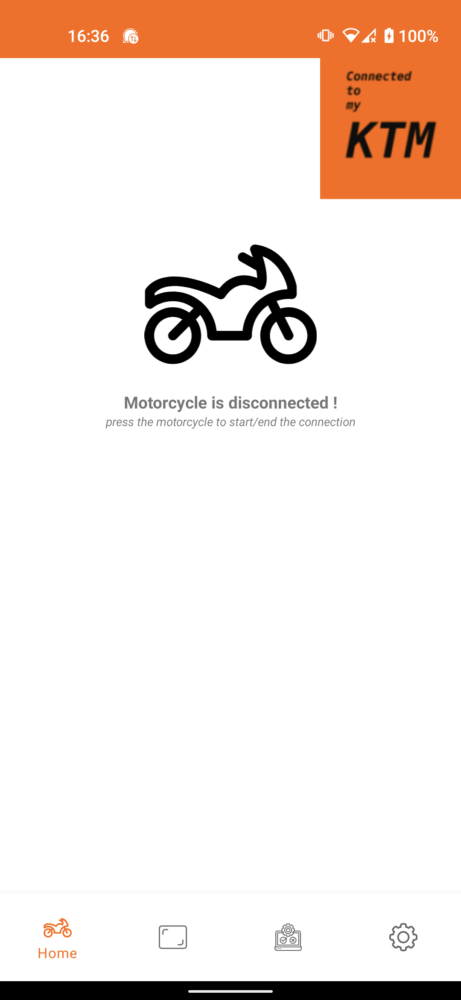
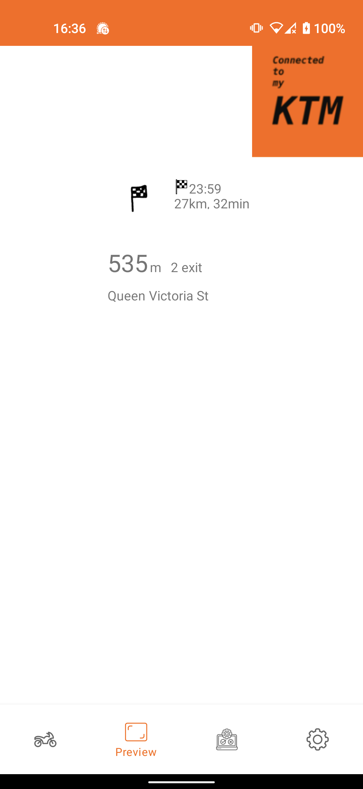
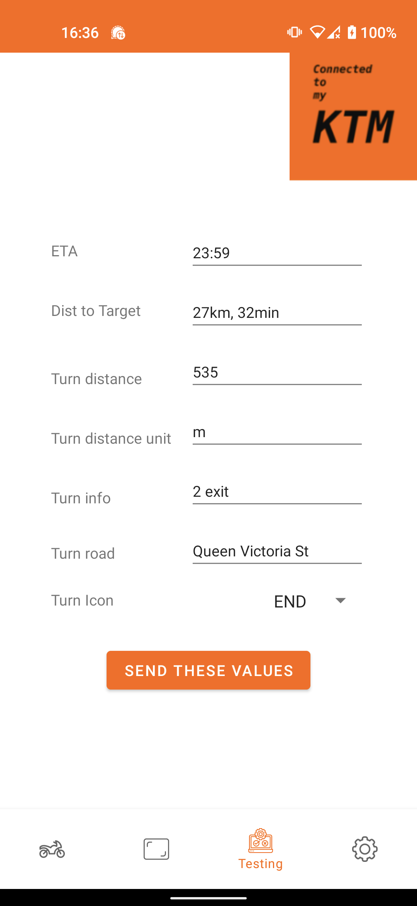
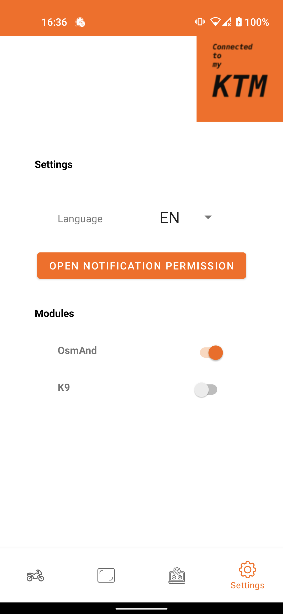

# Connected to my ktm

This project was developed in order to use the GPS option available on KTM motorcycles without having to use the official application that does not allow us to use another GPS application.

This project is completely open-source and does not contain any [**Anti-Features**](https://f-droid.org/docs/Anti-Features/)

## Motorcycle compatible
| Model | Year | compatible |
| --- | --- | --- |
| Ktm 790 adventure R | 2019 | ✅ |

## Application compatible
| Application | Version | compatible |
| --- | --- | --- |
| OsmAnd | 3.6.3 | ✅ |
| OsmAnd | 3.9 | ❔ |

## Screenshots

## Contribution Guide
If you have discovered a bug or need a new feature, feel free to create an issue directly on Github.

You can also contribute with a pull-request.

### Modules
If you want to add compatibility with another GPS application or other, you just have to implement the Module interface and add your module in the `HashMap` of `notification/NotificationListener.java`.

Concerning Google Maps, since I have a phone without google services I will not develop this module. However, if you want to create this module do not hesitate. Otherwise, there is this [application](https://play.google.com/store/apps/details?id=com.undingen.maps4ktm&hl=en_US&gl=US) may interest you.

## Permission

| Permission key | Usage |
|---|--- |
| `android.permission.BLUETOOTH`| Used to communicate with the motorcycle. |
| `android.permission.BIND_NOTIFICATION_LISTENER_SERVICE` | Used to read notifications in order to send them to the motorcycle |

## Credit
This project is inspired by this [application](https://play.google.com/store/apps/details?id=com.undingen.maps4ktm&hl=en_US&gl=US). More information about bluetooth communication [here](https://advrider.com/f/threads/ktm-my-ride-enhancements-needed.1435929/page-2).

## Conctact me
dev@guillaumepin.ch